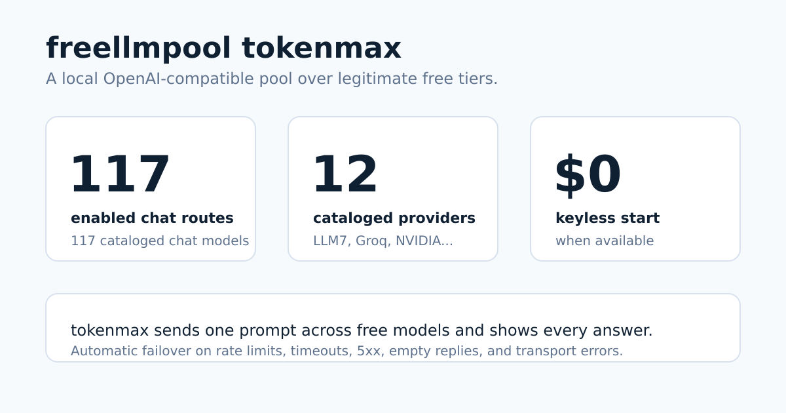

> **Guía histórica de compatibilidad 0.13.0.** Para la nueva pasarela mantenida, usa la [configuración guiada](integrations/setup/README.md): `freellmpool setup`. Los tiempos de inicio, los catálogos fijos y las cuotas orientativas de esta guía no describen la nueva versión del checkout.

# freellmpool

> Traducción al español de [README.md](README.md). Puede quedar por detrás de la
> versión en inglés; si algo no coincide, toma el README en inglés como fuente de
> verdad.





freellmpool cataloga 12 proveedores de LLM como grupos distintos que abarcan
niveles gratuitos recurrentes, endpoints sin clave, pruebas finitas, rutas solo
por pin y candidatos deshabilitados. Expone 117 rutas de chat habilitadas y
117 modelos de chat catalogados detrás de un endpoint compatible con OpenAI, y
agrupa automáticamente solo las rutas habilitadas a las que tienes acceso. Puede
empezar sin credenciales cuando hay una ruta sin clave habilitada y disponible.

[](https://pypi.org/project/freellmpool/)
[](https://github.com/0xzr/freellmpool/actions/workflows/ci.yml)
[](LICENSE)
[](https://0xzr.github.io/freellmpool/)

[FAQ](FAQ.md): a dónde van los prompts, postura de ToS, failover, bloqueos y
comparaciones.

## Estado de versión y distribución

- **Última versión: 0.13.0.** La versión de GitHub y el paquete de PyPI son
  0.13.0; incluyen el catálogo auditado, el endurecimiento de streaming y del
  sentinel, el perfil de Hermes, las APIs operativas `/livez`, `/readyz`,
  `/v1/providers` y `/v1/models?ready=true`, y el enrutamiento `spread`.

- **Estado de publicación en npm: pendiente.** `opencode-freellmpool` y
  `opencode-freellmpool-tui` están probados, pero no publicados en npm al
  2026-08-29. Por ahora usa las instrucciones de instalación local del repo.

## Inicio rápido en 30 segundos

Una instalación nueva hasta la primera respuesta toma unos 19 segundos en un
entorno limpio Linux/Python 3.12, sin claves de API cuando hay una ruta sin clave
habilitada y disponible:

```bash
python3 -m venv .venv
. .venv/bin/activate
python -m pip install --upgrade pip
python -m pip install freellmpool
freellmpool ask --max-tokens 32 "Reply with one short sentence: freellmpool is ready."
```

CI ejecuta la misma ruta desde este checkout con
`FREELLMPOOL_QUICKSTART_PACKAGE=. scripts/quickstart-test.sh`.

El catálogo incluye niveles gratuitos de proveedores, rutas sin clave y algunos
candidatos de prueba finita o deshabilitados. La elegibilidad y los límites
cambian por proveedor. freellmpool usa automáticamente solo rutas habilitadas a
las que tienes acceso, cambia a la siguiente ante rate limit o caída y registra
el uso diario local.

Kilo Gateway no necesita clave de
API, y LLM7 permite una clave opcional, así que el inicio rápido anterior puede
responder sin registro cuando una ruta sin clave está disponible.

Agrega las credenciales aplicables para desbloquear más rutas y capacidad; las
condiciones gratuitas, de prueba o de pago cambian por proveedor.

## Ejecuta un agente de código con modelos gratuitos

El proxy de freellmpool habla la API de OpenAI e incluye una ruta compatible
con Anthropic que todavía es experimental, así que los agentes de código pueden
usar niveles gratuitos agrupados sin cambiar código: basta con apuntarlos al
proxy.

```bash
freellmpool proxy                       # starts http://localhost:8080
freellmpool code claude                 # prints the one-line setup for Claude Code
freellmpool profile install hermes       # imprime la configuración
# (also: codex, aider, cline, continue, cursor, metaswarm, opencode)
```

El modo gateway de Claude Code también puede lanzarse directamente:

```bash
ANTHROPIC_BASE_URL=http://localhost:8080 \
ANTHROPIC_AUTH_TOKEN=dummy \
ANTHROPIC_MODEL=auto \
ANTHROPIC_SMALL_FAST_MODEL=auto \
CLAUDE_CODE_ENABLE_GATEWAY_MODEL_DISCOVERY=1 \
claude
```

Tus aplicaciones OpenAI/Anthropic existentes funcionan igual: define
`OPENAI_BASE_URL` (o `ANTHROPIC_BASE_URL`) al proxy y conserva tu código.

**OpenCode** tiene una integración más profunda: un **dashboard** en vivo dentro
del editor (modo de enrutamiento, $ ahorrados, tokens servidos gratis, carrera
de proveedores, latencia), **enrutamiento por calidad** por solicitud desde el
selector de modelos (`freellmpool/spread|auto|fast|quality|fair`) y herramientas
`freellmpool_status` / `freellmpool_models`. Consulta
[integrations/opencode-tui](integrations/opencode-tui) y la
[guía](https://0xzr.github.io/freellmpool/run-opencode-on-free-models.html).

**Nuevo en 0.11:** herramientas de capacidad. `freellmpool capacity status`
muestra qué niveles gratuitos son usables ahora, `freellmpool providers health`
los prueba en vivo, y `freellmpool keys add` te guía para configurar más (ver
[Capacidad y salud de proveedores](#capacidad-y-salud-de-proveedores) y
[docs/CAPACITY.md](docs/CAPACITY.md)).

**Nuevo en 0.10:** API asíncrona (`AsyncPool`), servidor MCP
(`freellmpool mcp`), enrutamiento consciente de latencia con
`freellmpool benchmark`, hooks de observabilidad y sistema de plugins para
proveedores personalizados. Consulta el [changelog](CHANGELOG.md).

## Instalación

```bash
pip install freellmpool      # or: pipx install freellmpool
```

La única dependencia es `httpx`. Python 3.11+.

## Línea de comandos

```bash
freellmpool ask "Write a haiku about sqlite"
git diff | freellmpool ask "Write a commit message for this"
freellmpool tokenmax "Hardest question you've got"  # 🌈 distribuye a objetivos elegibles y sintetiza
freellmpool providers        # which providers are configured
freellmpool models           # every provider/model id
freellmpool stats            # lifetime tokens served free + avoided cost
freellmpool badge -o badge.svg   # a shareable SVG badge of that total
```

`freellmpool tokenmax` es el modo de máximo esfuerzo: envía tu prompt a los
objetivos clasificados que sean automáticamente elegibles en los proveedores
configurados (límite estricto de 256); `--max-models`, la política de enrutamiento
o el modo `wise` pueden reducir el enjambre. Imprime las respuestas recibidas y
sintetiza el mejor veredicto mientras muestra una animación arcoíris
`TOKENMAXXING` en la terminal. También existe como herramienta MCP `tokenmax`;
consulta [docs/MCP.md](docs/MCP.md).

`freellmpool stats` es un total acumulado **persistente** de por vida (sobrevive
reinicios y actualizaciones). Inserta `freellmpool badge` en un README, o sírvelo
en vivo desde el proxy en `/badge.svg` (activa
`FREELLMPOOL_PUBLIC_BADGE=1` para hacerlo embebible públicamente).

Fija un proveedor o modelo; los nombres comunes de modelos OpenAI/Anthropic se
mapean a equivalentes gratuitos para que los scripts existentes sigan funcionando:

```bash
freellmpool ask -m groq/openai/gpt-oss-20b "hi"
freellmpool ask -p cerebras,groq "hi"
freellmpool ask -m gpt-4o-mini "hi"      # routed to a free model
```

## Como proxy

Ejecuta un servidor local que habla la API de OpenAI y apunta cualquier
herramienta compatible con OpenAI hacia él:

```bash
freellmpool proxy
export OPENAI_BASE_URL=http://localhost:8080/v1
export OPENAI_API_KEY=unused
```

```python
from openai import OpenAI
client = OpenAI()
print(client.chat.completions.create(
    model="auto",
    messages=[{"role": "user", "content": "hi"}],
).choices[0].message.content)

# audio → text (Whisper), same client:
print(client.audio.transcriptions.create(
    model="auto", file=open("audio.mp3", "rb"),
).text)
```

O con `curl` (subida multipart):

```bash
curl -s http://localhost:8080/v1/audio/transcriptions \
  -F file=@audio.mp3 -F model=auto
```

El proxy también implementa la API Responses de OpenAI (para Codex CLI) y una
ruta experimental compatible con Messages de Anthropic (para Claude Code), así
que los agentes de código también pueden correr sobre modelos gratuitos.
Las solicitudes de solo texto transmiten deltas de forma incremental; las
solicitudes con herramientas o contenido enriquecido conservan la ruta
bufferizada de compatibilidad.
`freellmpool code <agent>` imprime la configuración exacta:

```bash
freellmpool code aider       # also: claude, codex, cline, continue, cursor, hermes, opencode
```

Endpoints: `/v1/chat/completions` (streaming de tokens, tool calling),
`/v1/embeddings`, `/v1/audio/transcriptions` (Whisper, multipart),
`/v1/responses`, `/v1/messages`, `/v1/models` y una página `/dashboard` con uso.
`/`, `/dashboard` y `/playground` comparten un shell público sin datos. Si el
proxy usa autenticación, el shell guarda la clave solo en memoria de la página
y envía el encabezado `Authorization` en cada llamada protegida.
Los snippets para herramientas específicas están en
[docs/INTEGRATIONS.md](docs/INTEGRATIONS.md) y [docs/AGENTS.md](docs/AGENTS.md).

## Como biblioteca

```python
from freellmpool import Pool

pool = Pool.from_default_config()
reply = pool.ask("Summarize the plot of Hamlet in 20 words.")
print(reply.text, "—", reply.provider_id)

vectors = pool.embed(["first document", "second document"]).vectors

with open("audio.mp3", "rb") as f:
    text = pool.transcribe(f.read(), "audio.mp3").text   # Whisper, failover across providers
```

La API asíncrona es igual, con `await`:

```python
from freellmpool import AsyncPool

async with AsyncPool.from_default_config() as pool:
    reply = await pool.aask("Summarize the plot of Hamlet in 20 words.")
```

Pasa `on_event=...` a cualquiera de los pools para recibir eventos estructurados
de enrutamiento/cache (`attempt`/`success`/`error`/`cooldown`/`cache_hit`/
`cache_miss`/`exhausted`) para logs o tracing. Agrega tu propio endpoint con
`register_provider(...)`, o una nueva forma de solicitud con
`register_adapter(name, fn)`.

## Benchmark de tus proveedores

`freellmpool benchmark` mide una llamada por proveedor configurado e imprime
latencia y éxito, para ver cuáles de tus niveles gratuitos están más rápidos
ahora. El router aprende la misma señal de latencia/éxito del tráfico real; usa
`FREELLMPOOL_ROUTING=fast` para preferir el proveedor con menor latencia en vez
del least-used-first predeterminado.

```
$ freellmpool benchmark
  provider/model            status   latency  note
  cerebras/gpt-oss-120b     ok        180 ms  6 tok
  groq/openai/gpt-oss-20b   ok        240 ms  6 tok
```

## Capacidad y salud de proveedores

Los niveles gratuitos cambian durante el día: las claves expiran, los proveedores
caen y los cupos diarios se llenan. Estos comandos te dicen qué es usable ahora
y qué configurar después:

```bash
freellmpool capacity status --target 5   # who's healthy / near quota / missing a key
freellmpool capacity status --refresh    # refresh explícito del catálogo consultivo
freellmpool providers health             # send one tiny request to each, time it
freellmpool keys checklist --target 5    # which keys to add to reach N healthy providers
freellmpool keys add groq                # configure a key (and record metadata)
```

`capacity status` es offline y cache-first: lee tu catálogo, entorno y contadores diarios,
y etiqueta cada proveedor como `healthy`, `low_quota`, `exhausted`, `invalid_key`,
`missing` o `disabled`; este último significa que no tiene modelos habilitados y
no cuenta como capacidad. El cache del catálogo externo consultivo
([mnfst/awesome-free-llm-apis](https://github.com/mnfst/awesome-free-llm-apis))
puede sugerir proveedores gratuitos que podrías agregar. Solo
`freellmpool capacity status --refresh` o `freellmpool catalog sync` usa la red
para actualizarlo; es solo consultivo y tu
`providers.toml` sigue siendo la fuente de verdad para el enrutamiento.
`keys add <name>` incluso puede importar un proveedor sugerido de ese catálogo o
crear un stub compatible con OpenAI y autodetectar sus modelos. El `/dashboard`
del proxy muestra la misma capacidad de un vistazo. Referencia completa:
[docs/CAPACITY.md](docs/CAPACITY.md).

## Modelos locales (explícitos y pin-only)

LM Studio, Ollama y llama.cpp se pueden previsualizar sin escanear la LAN ni los
procesos:

```bash
freellmpool local discover
freellmpool local import --name ollama --yes
freellmpool ask --providers local_ollama --model "<modelo-descubierto>" "hola"
```

El descubrimiento consulta solo una lista pequeña de URLs loopback literales y
no envía credenciales ni sigue redirecciones. La importación es un paso afirmativo
separado y deja todos los modelos fuera del enrutamiento automático. Se revierte
con `freellmpool local remove local_ollama --yes`.

## Como servidor MCP

`freellmpool mcp` ejecuta un servidor Model Context Protocol sobre stdio, para
que Claude Desktop, Claude Code o Cursor puedan delegar subtareas a modelos
gratuitos. Consulta [docs/MCP.md](docs/MCP.md). Se incluye un
[`server.json`](server.json) para el [registro MCP](https://registry.modelcontextprotocol.io/).

## En el CLI `llm` de Simon Willison

Hay un plugin: `llm install llm-freellmpool` -> `llm -m freellmpool "..."`. Puede
responder sin clave mientras haya una ruta sin clave habilitada y disponible.
Fuente: [plugins/llm-freellmpool](plugins/llm-freellmpool/).

## Claves de proveedores

freellmpool lee claves del entorno y usa las que estén definidas. No hace falta
una clave mientras haya una ruta sin clave habilitada; las credenciales amplían
las rutas accesibles. Los enlaces de alta y las salvedades sobre verificación,
tarjeta, prueba finita o precio están en [docs/ACCOUNTS.md](docs/ACCOUNTS.md).

| Proveedor | Variable de entorno | Notas |
|---|---|---|
| Kilo Gateway | — | no necesita clave |
| LLM7 | `LLM7_API_KEY` | opcional |
| Groq | `GROQ_API_KEY` | rutas del plan gratuito actual; los límites varían por modelo |
| NVIDIA NIM | `NVIDIA_API_KEY` | |
| OpenRouter | `OPENROUTER_API_KEY` | modelos gratuitos |
| Google Gemini | `GEMINI_API_KEY` | |
| Cloudflare | `CLOUDFLARE_API_TOKEN` + `CLOUDFLARE_ACCOUNT_ID` | |
| OpenCode Zen | — | rutas gratuitas dinámicas sujetas a evidencia actual |
| Vercel AI Gateway | `AI_GATEWAY_API_KEY` | solo Poolside con precio público verificado en cero; requiere evidencia actual |
| Mistral, Cohere, Z.ai, Ollama Cloud | ver `.env.example` | |

Un `config.toml` (ver [config.toml.example](config.toml.example)) puede guardar
claves, alias de modelos y ajustes en vez de variables de entorno.

## Diagnóstico local y operaciones

Ejecuta `freellmpool doctor` para una revisión local sin red de la versión del
paquete, rutas de configuración, conteo de proveedores configurados, modo de
enrutamiento, ubicaciones de quota/cache, antigüedad del cache del catálogo
externo y validez del catálogo incluido.

El cache de respuestas está apagado salvo que `FREELLMPOOL_CACHE_TTL` (segundos)
o `[settings] cache_ttl` sea positivo. Cuando se activa, las filas viven en
SQLite con modo WAL y poda por TTL; `FREELLMPOOL_CACHE_MAX_ENTRIES` limita filas
retenidas (predeterminado `10000`, usa `0` para desactivar poda por tamaño).

Los contadores de cuota se escriben de inmediato por defecto. Procesos largos de
proxy/MCP pueden reducir escrituras con `FREELLMPOOL_QUOTA_FLUSH_EVERY=N`, que
agrupa hasta `N` solicitudes exitosas antes de volcar. Las rutas de apagado y
`quota.snapshot()` vuelcan los conteos pendientes, así que dashboards y salidas
de proceso ven totales actuales.

## Cómo funciona el enrutamiento

Para cada solicitud, freellmpool construye la lista de pares `(provider, model)`
a los que tienes acceso, ordena proveedores por menor uso y elige un modelo con
menor uso dentro de ese proveedor. Así los proveedores con catálogos grandes,
como NVIDIA, no reciben más tráfico solo por exponer más modelos. Un proveedor
que devuelve 429 se aparta durante una ventana de cooldown. Los conteos diarios
se guardan en `~/.config/freellmpool/quota.json` y se reinician a medianoche UTC.

Cada llamada registra latencia y éxito por objetivo de modelo. Un proveedor cuyos
objetivos fallan se hunde al final automáticamente; con `FREELLMPOOL_ROUTING=fast`
el proveedor medido más rápido va primero. `freellmpool benchmark` calienta estas
métricas bajo demanda. Para restaurar el comportamiento antiguo de balanceo por
modelo, usa `FREELLMPOOL_ROUTING=legacy` o `FREELLMPOOL_ROUTING=model` (o
`FREELLMPOOL_ROUTING=model-fast` para el antiguo fastest-first por modelo).

**Enrutamiento por calidad (`FREELLMPOOL_ROUTING=quality`).** Los modelos más
fuertes de los niveles gratuitos tienen los cupos diarios más pequeños, así que
una bolsa ingenua se debilita durante el día. El enrutamiento por calidad asigna
la *dificultad* de cada prompt a la *capacidad* de cada modelo: prompts difíciles
(entrada larga, código, señales de razonamiento) van al modelo disponible más
fuerte, y los fáciles a modelos ligeros. Así se raciona la cuota escasa de
modelos fuertes y la bolsa se mantiene útil por más tiempo. La capacidad se basa
en benchmarks reales, no en nombres; si un modelo no aparece en ningún benchmark,
se usa una heurística por nombre.

Las puntuaciones offline incluidas vienen del Elo de [LMArena](https://lmarena.ai/)
(snapshot con licencia MIT) y del leaderboard de edición de código de
[Aider](https://aider.chat/) (Apache-2.0), normalizados a una escala percentil.
Para mucha más cobertura, ejecuta `freellmpool capability sync` con una clave
gratuita de [Artificial Analysis](https://artificialanalysis.ai/)
(`FREELLMPOOL_AA_API_KEY`); su Intelligence Index cubre la mayoría de modelos
actuales y open-weight y tiene prioridad. Los datos AA descargados se cachean
localmente bajo tu propia clave (nunca se empaquetan, por sus términos).
`freellmpool capability status` muestra la cobertura actual. Scores vía LMArena
y Aider; intelligence index vía Artificial Analysis cuando hay clave.

**Ventanas de contexto.** Los modelos gratuitos suelen tener ventanas de contexto
pequeñas. freellmpool nunca trunca tu entrada; cuando un modelo rechaza una
solicitud por ser demasiado larga, aprende el límite de ese modelo y deja de
enrutar allí entradas sobredimensionadas, escalando solo a modelos con ventanas
mayores. Si nada cabe, lanza un `ContextWindowExceeded` claro (con el tamaño de
entrada estimado) en vez de un fallo genérico; sobre el proxy eso es un `413`.
Puedes declarar la ventana de un modelo con `context = N` en `providers.toml`
para saltarlo de forma proactiva.

Notas de arquitectura: [docs/ARCHITECTURE.md](docs/ARCHITECTURE.md).

## Limitaciones

- Los modelos de niveles gratuitos son más pequeños que los modelos frontera.
  Sirven para borradores, resúmenes, clasificación, triage y código cotidiano,
  no como reemplazo de razonamiento GPT-class en problemas difíciles.
- La calidad y capacidad varían durante el día a medida que se agotan niveles
  con cupos altos. Los contadores diarios locales de freellmpool se reinician a
  medianoche UTC; cada proveedor upstream usa sus propios límites y ventanas de
  reinicio.
- Los niveles gratuitos cambian sin aviso. Cuando un id de modelo o límite queda
  obsoleto, un PR de una línea a `providers.toml` lo corrige para todos.
- El proxy está pensado para uso local/de un solo usuario. Se enlaza a
  `127.0.0.1` por defecto; si lo expones, configura una clave (`--api-key`).
- La ruta Claude Code / Anthropic es experimental (texto y herramientas; sin
  visión).
- Estos son niveles gratuitos compartidos por todos; no abuses de ellos.

## Cómo se compara

| Herramienta | Inicio sin clave | # proveedores | Failover | Servidor MCP | CLI | Transcripción | Local/self-hosted | Licencia |
|---|---|---:|---|---|---|---|---|---|
| **freellmpool** | Sí, cuando hay disponible un proveedor sin clave configurado | 12 proveedores de chat catalogados localmente | Sí: fallos reintentables, respuestas vacías y errores de transporte | Sí: `freellmpool mcp` | CLI one-shot más perfiles, biblioteca y proxy | Sí: `/v1/audio/transcriptions` con failover | Sí: paquete Python y proxy local | MIT |
| [OpenRouter free models](https://openrouter.ai/openrouter/free/providers) | No: el servicio hospedado requiere cuenta/clave | Router hospedado; su lista gratuita cambia | Sí: fallbacks de proveedor/modelo | Sí: servidor MCP remoto hospedado | API/SDK hospedados, no gateway CLI local | Audio/transcripción vía chat multimodal | No: servicio hospedado | Servicio propietario |
| [LiteLLM](https://github.com/BerriAI/litellm/blob/5d4c4d0fce45c73c4b56b48e46dfc4e56e8b0aa5/README.md) | No: aporta credenciales de proveedor o gateway | El README afirma 100+ LLM/proveedores | Sí: router, reintentos y fallbacks | Sí: AI Gateway incluye MCP Gateway | SDK y proxy/gateway CLI | Sí: `/audio/transcriptions` | Sí: proxy self-hosted u oferta hospedada | Core MIT; funciones enterprise comerciales |
| [OmniRoute](https://github.com/diegosouzapw/OmniRoute/blob/d8ff51874c8add566d43225988b9bc67e0542d65/README.md) | Sí: documenta una opción OpenCode sin autenticación | El README afirma 268 integraciones/proveedores y 90+ opciones gratuitas | Sí: routing y circuit breaker por capas | Sí: planos MCP y A2A | CLI amplio y configuración de agentes | Documenta traducción de audio; otras capacidades varían | Sí: Node, dashboard, Docker y desktop/PWA | MIT |
| [FreeLLMAPI](https://github.com/tashfeenahmed/freellmapi/blob/759de8e7ed1edc1cd513c9777cd0a807fb5ceee3/README.md) | El servidor arranca con Docker; la capacidad se configura después | El README afirma 28 proveedores gratuitos y 339 endpoints | Sí: routing/fallback por proveedor y clave | Sí: MCP (Streamable HTTP) | Dashboard/servidor y apps desktop | No documenta transcripción; sí soporta voz/TTS | Sí: servidor Node/Docker y apps desktop | MIT |

FreeLLMAPI existe antes que este proyecto, y el solapamiento es convergencia
independiente: ambos proyectos notaron que los niveles gratuitos legítimos son
útiles cuando se tratan con cuidado. OmniRoute prioriza un control plane amplio
y muchos protocolos; FreeLLMAPI, un router self-hosted centrado en dashboard;
freellmpool, la ruta Python/CLI/biblioteca más pequeña con inicio keyless
condicional. Son decisiones de alcance, no una afirmación de superioridad para
cada despliegue.

Fuentes de la tabla: catálogo y código de proxy de freellmpool en este repo;
docs de quickstart, modelos gratuitos, routing y audio de OpenRouter; README,
docs MCP y docs de transcripción de LiteLLM; y los README inmutables enlazados
de OmniRoute y FreeLLMAPI.

## Preguntas frecuentes

**¿Hay un gateway LLM API gratis y compatible con OpenAI?** Sí. freellmpool es
un gateway gratuito con licencia MIT que expone un endpoint compatible con
OpenAI sobre las rutas habilitadas a las que tienes acceso. Sus 22 grupos
catalogados abarcan niveles gratuitos recurrentes, endpoints sin clave, pruebas
finitas, rutas solo por pin y candidatos deshabilitados.

**¿Cómo uso varias APIs LLM gratuitas a la vez?** freellmpool las agrupa: cada
solicitud va a un proveedor al que tienes acceso, falla al siguiente cuando uno
está rate-limited o caído, y registra uso diario para repartir carga entre
niveles.

**¿Puedo ejecutar Claude Code o Codex con modelos gratuitos?** Sí. El proxy habla
la API de OpenAI e incluye una ruta experimental compatible con Anthropic.
Define `OPENAI_BASE_URL` o `ANTHROPIC_BASE_URL` al proxy y ejecuta Codex, Claude
Code, aider, Cline, Continue o Cursor sin cambios. Para Claude Code, define
`CLAUDE_CODE_ENABLE_GATEWAY_MODEL_DISCOVERY=1` para que `/v1/models` se descubra
a través del puente Anthropic. Consulta `freellmpool code <agent>`. (La ruta
Claude Code es experimental: texto + herramientas, sin visión.)

**¿Necesito una clave de API?** No mientras haya una ruta sin clave habilitada y disponible:
Kilo Gateway expone rutas sin clave, y LLM7 permite una
clave opcional. Agrega credenciales gratuitas o de prueba cuando correspondan
para ampliar rutas y capacidad; las condiciones cambian por proveedor.

**¿Es gratis y open source?** Sí, licencia MIT. Más en la
[página del proyecto](https://0xzr.github.io/freellmpool/).

## Destacado en

- Videos de la comunidad (por lytohlg AI): ["Accede a 18 modelos de IA GRATIS con 1 solo comando"](https://www.youtube.com/watch?v=1UfIlWoedho) y ["Prueba 18 IAs GRATIS sin API key en 30 segundos"](https://www.youtube.com/watch?v=oaM_E92WVGQ) (usan un catálogo anterior; ahora freellmpool cataloga 15 proveedores).
- Directorio: [FreeLLM Pool en MCP Market](https://mcpmarket.com/server/freellm-pool).

## Contribuir

Nuevos proveedores y correcciones a límites obsoletos son las contribuciones más
útiles, y normalmente son un cambio pequeño en `providers.toml`. Consulta
[CONTRIBUTING.md](CONTRIBUTING.md). Las tareas para nuevos contribuidores,
listas para mantenedores, están en
[docs/GOOD_FIRST_ISSUES.md](docs/GOOD_FIRST_ISSUES.md). Las pruebas corren sin
acceso de red:

```bash
python -m pip install -e ".[dev]" && ruff check . && pytest
```

## Licencia

MIT
